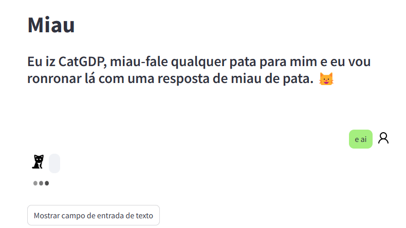

# Ideias para continuidade do projeto
#### aqui serão registrados os avanços e ideias, onde utilizar e como pensei que irão ficar.

_________

## Ideias do streamlit:
###### links de funcionalidades que irei testar.

    1. Pagina de gráficos: existe um link do streamlit que demonstra um gráfico bem promissor. Esse tipo de gráfico pode ser até mesmo clicável: 
    
[Clique aqui para visitar o link](https://echarts.streamlit.app/?ref=streamlit-io-gallery-favorites)
[link de onde criar](https://echarts.apache.org/examples/en/editor.html?c=line-simple)
[echarts javascript](https://echarts.apache.org/handbook/en/get-started/)

    2. Página de gráficos: existe também os gráficos de séries temporais, mas pelo jeito é meio pesado, tem que estudar a performance.
[prophet streamlit](https://prophet.streamlit.app/?ref=streamlit-io-gallery-favorites)

    3. Página home: Talvez possamos inserir na pagima de home um bot para responder algumas coisas, como linha de frente para os problemas mais repetidos

[Magic chat - esboço de como seria](https://weaviate-magic-chat.streamlit.app/?ref=streamlit-io-gallery-favorites)
[streamly](https://streamly.streamlit.app/?**ref**=streamlit-io-gallery-favorites)

    4. criação de uma busca por erros/lista de algo. Não sei bem como eu utilizaria isso...
[Tissues streamlit](https://tissues.streamlit.app/)

    5. Página de formulários: Pode ser possível que no futuro a gente possa conseguir também pegar arquivos gerados e ler eles para criar alertas
[tipos de input](https://molecule-icon-generator.streamlit.app/?ref=streamlit-io-gallery-favorites)